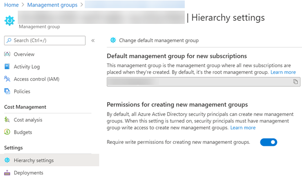

# ARM templates for landing zones (subscriptions)

This folder contains example ARM templates for organizations to create new subscriptions into management groups.

## Recommendations

In order to create subscriptions at scale using ARM templates, we strongly recommends the following settings, convention and authoring styles.

* Always use the “scope” resource property to route the request to the tenant root

    As subscriptions should be placed into a management group, we recommend to invoke the template deployment at the targeted management group, and use the "scope" property to interact with the tenant RP directly vs invoking the deployment at the tenant root (/). From a security perspective, this reduces need for having blast-radius permissions in the Azure tenant.

    The example resource below shows how to use the "scope" property and route the request to the tenant root.

    ````json
    {
            "scope": "/", // routing the request to tenant root
            "name": "[parameters('subscriptionAliasName')]",
            "type": "Microsoft.Subscription/aliases",
            "apiVersion": "2020-09-01",
            ...
    }
    ````

* Always include the “managementGroupId” property and target the same Management Group as where you are invoking the ARM template deployment.

    Subscriptions can be placed into a management group either by providing the managementGroupId in the request body (properties bag), and as a subsequent request using the Microsoft.Management/managementGroups/subscriptions resource type.
    In order to leave the subscription creation process as an atomic operation, we therefor recommend to provide the management group id in the property bag of the subscription alias instead of having an additional resource to do the required move of the subscription post deployment.

    The example below shows the "managementGroupId" property using the "targetManagementGroup" parameter to determine the placement of the subscription.

    ````json
        "properties": {
            "workLoad": "Production",
            "displayName": "[parameters('subscriptionAliasName')]",
            "billingScope": "[parameters('billingAccountId')]",
            "managementGroupId": "[tenantResourceId('Microsoft.Management/managementGroups/', parameters('targetManagementGroup'))]"
            }
    ````

* Always use the same name for the aliases resource and the subscription display name

    To create a subscription, you will use the "Microsoft.Subscription/aliases" resource type. This resource is _only_ used for creation of subscriptions using ARM templates, and not by any other client experience post creation. We therefor recommend to use the same name for the alias and the displayName for the subscription to control the uniqueness in your tenant.

    The example below shows that the 'subscriptionAliasName' parameter is used for both the aliases name, and the displayName of the subscription.

    ````json

        {
            "scope": "/", // routing the request to tenant root
            "name": "[parameters('subscriptionAliasName')]",
            "type": "Microsoft.Subscription/aliases",
            "apiVersion": "2020-09-01",
            "properties": {
                "workLoad": "Production",
                "displayName": "[parameters('subscriptionAliasName')]",
                "billingScope": "[parameters('billingAccountId')]",
                "managementGroupId": "[tenantResourceId('Microsoft.Management/managementGroups/', parameters('targetManagementGroup'))]"
            }
        }
    ````

* Use expression evaluations scopes for subsequent deployments to the subscription that will be created

    As the subscriptionId is generated in the backend in Azure, you must reference the "subscriptionId" property in the outputs section using inner scope evaluation, and use reference() of the output as input to new parameters for subsequent deployments.

    The example below shows the output being referenced from the deployment that creates the subscription, to a subsequent deployment to the subscription by providing the subscriptionId

    ````json
                        "outputs": {
                        // Referencing the guid generated for the subscription to be used in subsequent (optional) deployments to this subscription
                        "subscriptionId": {
                            "type": "string",
                            "value": "[reference(parameters('subAliasName')).subscriptionId]"
                        }
                    }
                }
            }
        },
        {
            // Creating deployment to invoke policyAssignment of newly created subscription
            "scope": "[concat('Microsoft.Management/managementGroups/', parameters('targetManagementGroup'))]",
            "type": "Microsoft.Resources/deployments",
            "apiVersion": "2019-08-01",
            "name": "[concat('vnet-', parameters('subscriptionAliasName'))]",
            "location": "[deployment().location]",
            "dependsOn": [
                "[concat('Microsoft.Resources/deployments/', 'create-', parameters('subscriptionAliasName'))]"
            ],
            "properties": {
                "mode": "Incremental",
                "expressionEvaluationOptions": {
                    "scope": "inner"
                },
                "parameters": {
                    // Value coming from the previous deployment's output inner scope to be used to target subscription deployments
                    "targetSubscriptionId": {
                        "value": "[reference(concat('create-', parameters('subscriptionAliasName'))).outputs.subscriptionId.value]"
                    },
    ````

* Enable the Management Group hierarchy settings

    It is recommend to enable the management group hierarchy settings in your Azure tenant to ensure that role-based-access-control is required to create, update, and delete management groups. By enabling this setting default management group for new subscription has to be specified.

    
